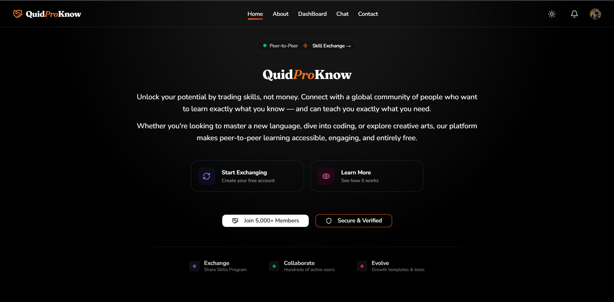
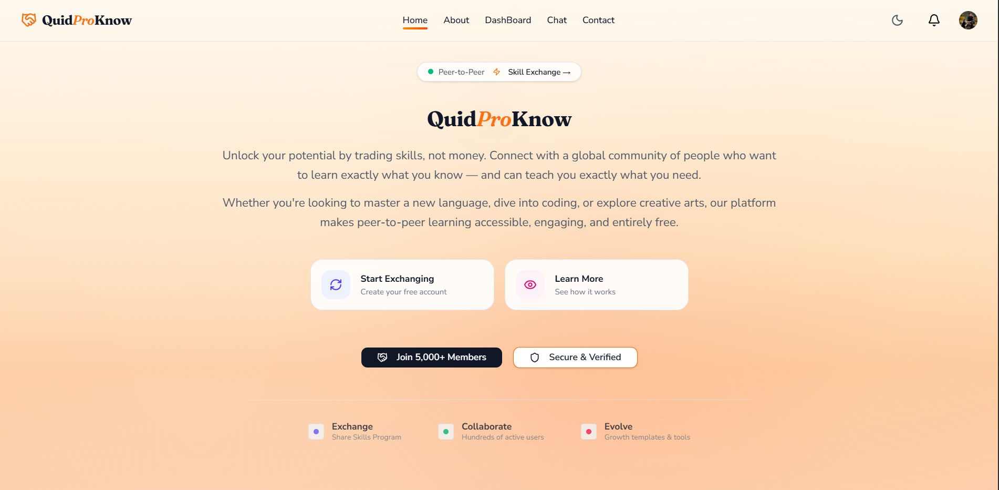
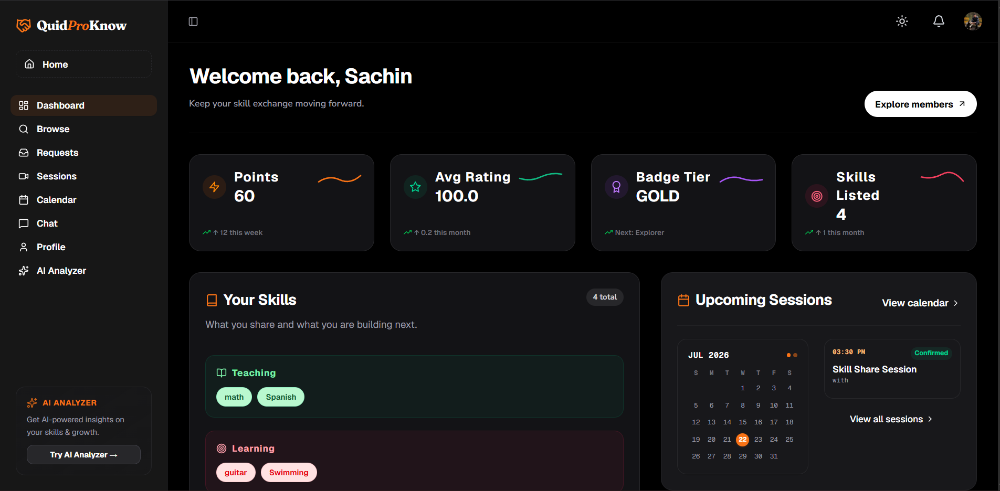
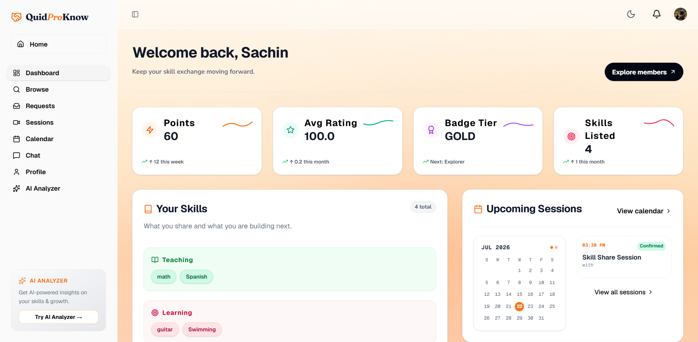
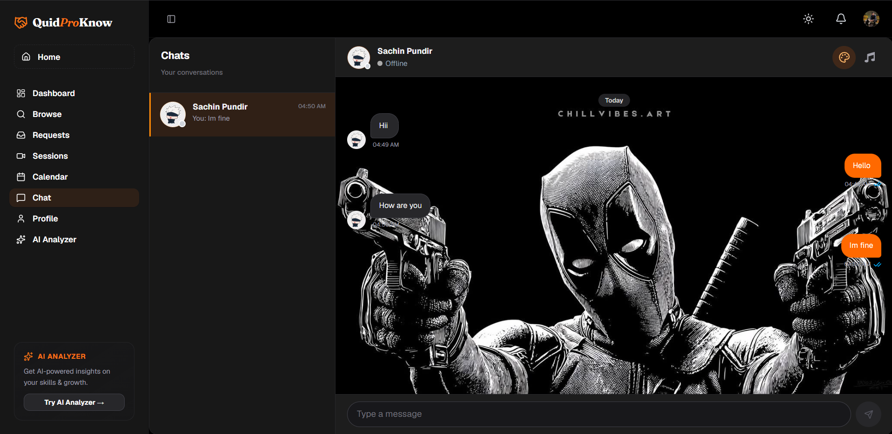
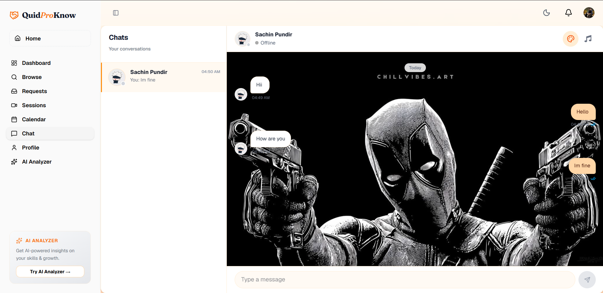
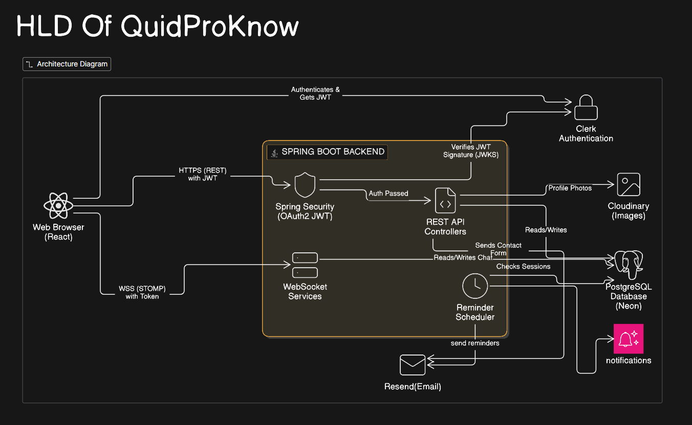
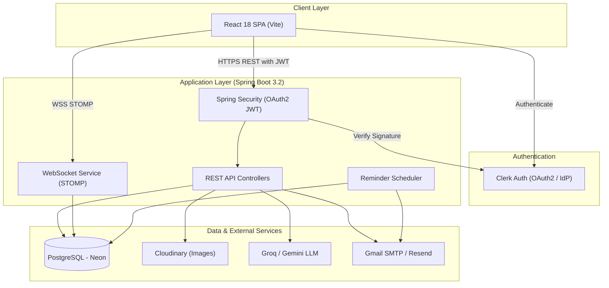
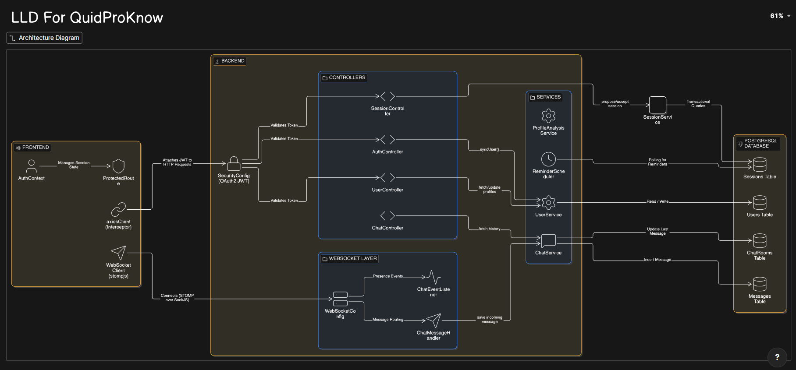
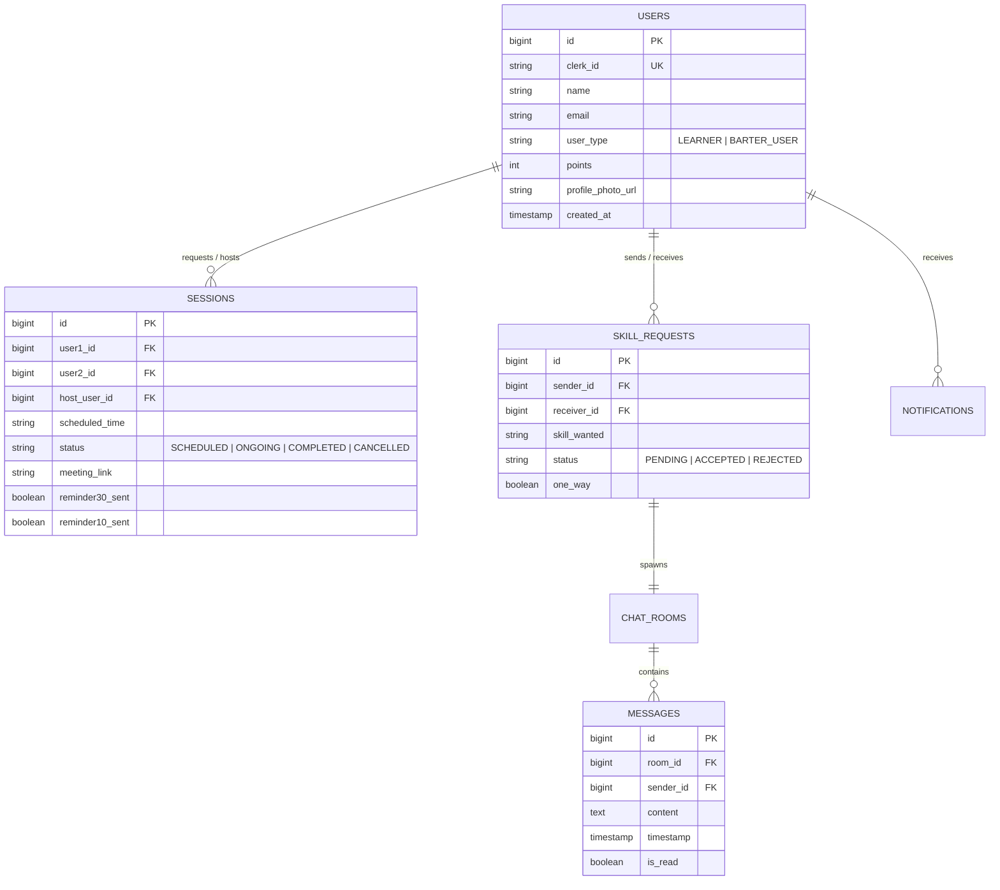

# QuidProKnow

A peer-to-peer skill-exchange platform. List skills you can teach and skills you want to learn, get matched with compatible users, schedule a session with a video-call link, chat in real time, and rate each other afterward. Profiles can also be run through an AI-powered analyzer for a completeness score and personalized feedback.

> Originally prototyped as a Java Swing + SQLite desktop app, then rebuilt from scratch as a production-style web application.

---

## Features

- **JWT authentication** with BCrypt password hashing
- **Two account types** with different matching rules:
  - `LEARNER` — one-directional requests, pays points to learn
  - `BARTER_USER` — bidirectional skill-for-skill trades
- **Skill compatibility validation**, enforced on both frontend (instant UX feedback) and backend (authoritative)
- **Session scheduling** with double-booking prevention, past-date prevention, and support for Google Meet / Zoom / Microsoft Teams / Jitsi links
- **Points economy** — earn points teaching, spend points learning, refunds on cancellation
- **Real-time chat** over WebSocket/STOMP/SockJS with typing indicators, online presence, and read receipts
- **Automatic session reminders** (30 min / 10 min / at start time) via a background scheduler
- **Public profiles** with photo upload, GitHub/LinkedIn links, projects, and written reviews
- **AI profile analyzer** — a deterministic rule-based score (0–100) plus short AI-generated coaching text (Groq, `llama-3.3-70b-versatile`), cached for 24 hours per profile
- **In-app notifications** for nearly every state change (requests, sessions, ratings, chat rooms)

---

## Screenshots

<div align="center">
  <table>
    <tr>
      <td width="50%"></td>
      <td width="50%"></td>
    </tr>
     <tr>
       <td width="50%"></td>
      <td width="50%"></td>
    </tr>
    <tr>
       <td width="50%"></td>
      <td width="50%"></td>
    </tr>
  </table>
</div>

---

## Tech Stack

**Backend**
- Java 21+, Spring Boot 3.2
- Spring Security + OAuth2 JWT (Clerk IdP)
- Spring Data JPA / Hibernate
- PostgreSQL (Hosted on Neon)
- Spring WebSocket (STOMP over SockJS)
- Spring Scheduler (Email & Notification Engine)
- Cloudinary (profile photo storage)
- Lombok, Maven

**Frontend**
- React 18 + Vite 5
- TailwindCSS
- React Router
- Axios (with Clerk JWT interceptor)
- `@stomp/stompjs` + `sockjs-client`

**AI & Email Services**
- Groq API — `llama-3.3-70b-versatile` / Gemini API
- Gmail SMTP / Resend API

---

## System Design

> 🔗 **Interactive Diagrams**: [View Full Architecture Workspace on Eraser.io](https://app.eraser.io/workspace/5Zqsighpz7jUk1cPJm1R?origin=share&elements=TqvV97pKoxPW7sDMlQ_x8A)

### High Level Design (HLD)

QuidProKnow is built with a modern client-server architecture, decoupling the React presentation layer from the Spring Boot business logic layer.





#### Key Architecture Principles:
- **Stateless Authentication**: Spring Security acts as an OAuth2 Resource Server, verifying Clerk-issued JWTs against Clerk's JWKS public keys without storing passwords locally.
- **Real-Time Communication**: Persistent full-duplex STOMP over WebSocket channels for 1-on-1 instant messaging, read receipts, and online presence.
- **Background Scheduling**: Spring `@Scheduled` task loop running every 60 seconds to evaluate session start times and send Google Calendar integration & reminder emails.
- **AI Integration**: Profile analysis utilizing Groq (`llama-3.3-70b-versatile`) or Gemini with 24-hour database caching to eliminate redundant LLM calls.

---

### Low Level Design (LLD)



#### 1. Entity-Relationship & Database Schema (PostgreSQL)



#### 2. Backend Class Architecture (Spring Boot)
- **Security**: `SecurityConfig` enforces OAuth2 JWT resource server validation and CORS rules.
- **Controllers**:
  - `AuthController`: Handles `/api/auth/sync` to persist Clerk user metadata in PostgreSQL.
  - `SkillRequestController`: Handles `/api/requests/**` for creation, acceptance, and rejection of skill exchanges.
  - `SessionController`: Manages session scheduling, updates, and ratings.
  - `ChatController` & `WebSocketConfig`: Handles HTTP message history and real-time STOMP messaging via `/ws`.
- **Services**:
  - `SkillRequestService`: Enforces skill compatibility matching, point deductions for `LEARNER` accounts, and triggers `EmailService` on accept.
  - `EmailService`: Formats and dispatches HTML emails with Google Calendar pre-filled event links (`https://calendar.google.com/calendar/render?action=TEMPLATE...`).
  - `ReminderScheduler`: Periodically checks sessions and dispatches 30-min email and in-app alerts.

#### 3. Frontend Architecture (React)
- **`ThemeContext`**: Global theme state manager (defaults to Dark Mode, persists to `localStorage`).
- **`AuthContext`**: Wraps Clerk provider and syncs user state with backend `/api/auth/sync`.
- **`axiosClient`**: Interceptor attaching Clerk Bearer token to all outgoing REST calls.

---

## Project Structure

```
QuidProKnow/
├── backend/
│   └── src/main/java/com/skillify/
│       ├── entity/          User, UserSkill, Session, SkillRequest, Notification, enums
│       ├── repository/      Spring Data JPA repositories
│       ├── service/          AuthService, UserService, SessionService, SkillRequestService, NotificationService
│       ├── controller/       REST controllers (/api/auth, /api/users, /api/sessions, /api/requests, /api/notifications)
│       ├── security/          JwtUtil, JwtAuthFilter, CustomUserDetailsService, UserPrincipal
│       ├── config/            SecurityConfig, WebConfig, CloudinaryConfig
│       ├── chat/               ChatRoom/Message entities, ChatService, PresenceService, WebSocketConfig
│       ├── ai/                  ProfileScoreService (rules), GroqService (LLM), ProfileAnalysisService (orchestrator)
│       ├── scheduler/         ReminderScheduler
│       └── util/               MeetingLinkValidator
└── frontend/
    └── src/
        ├── api/            axios service wrappers + websocket.js (STOMP client)
        ├── context/        AuthContext.jsx
        ├── components/     Navbar, UserCard, SkillTagInput, chat/, sessions/
        ├── pages/          Landing, Login, Register, Dashboard, BrowseUsers, Profile, Sessions,
        │                   Calendar, Requests, Chat, Notifications, ProfileAnalyzer
        ├── utils/          compatibility.js, resolvePhotoUrl.js
        └── styles/         index.css (burgundy #7A1E34 / olive green #5A6B3A theme)
```

---

## Prerequisites

- **Java 21+** and **Maven**
- **Node.js 18+** and **npm**
- **MySQL** (local instance, or a hosted one)
- A **Groq API key** ([console.groq.com](https://console.groq.com)) — required for the AI profile analyzer
- (Optional) A **Cloudinary** account — used for profile photo uploads

---

## Setup

### 1. Clone the repo

```bash
git clone https://github.com/SachinPundir78/Prototype-.git
cd Prototype-
```

### 2. Backend

The backend reads all secrets from environment variables, with safe local defaults baked into `application.properties`:

| Variable | Default (local) | Required in production? |
|---|---|---|
| `DB_URL` | `jdbc:mysql://localhost:3306/quidproknow?...` | Yes |
| `DB_USERNAME` | `root` | Yes |
| `DB_PASSWORD` | *(empty)* | Yes |
| `JWT_SECRET` | dev placeholder (32+ bytes) |Yes|
| `CORS_ALLOWED_ORIGINS` | `http://localhost:5173` | Yes |
| `GROQ_API_KEY` | *(none)* | Yes, for the AI analyzer (or use GEMINI_API_KEY) |
| `GEMINI_API_KEY` | *(none)* | Optional alternative to Groq |
| `RESEND_API_KEY` | *(none)* | Yes, for contact form emails |
| `CLOUDINARY_CLOUD_NAME` / `CLOUDINARY_API_KEY` / `CLOUDINARY_API_SECRET` | *(none)* | Yes, for photo uploads |
| `PORT` | `8080` | No |

MySQL will auto-create the `QuidProKnow` database on first run (`createDatabaseIfNotExist=true`), and Hibernate will create/update tables (`spring.jpa.hibernate.ddl-auto=update`).

**Set the Groq key** (Windows / PowerShell, permanent for your user):

```powershell
[System.Environment]::SetEnvironmentVariable("GROQ_API_KEY", "your-key-here", "User")
```

**macOS/Linux** (add to `~/.bashrc` / `~/.zshrc`):

```bash
export GROQ_API_KEY="your-key-here"
```

> Don't put `GROQ_API_KEY` in `application.properties` directly — it gets overwritten on rebuilds. Environment variables are the reliable path.

Run the backend:

```bash
cd backend
mvn spring-boot:run
```

The API will start on `http://localhost:8080`.

### 3. Frontend

```bash
cd frontend
npm install
cp .env.example .env
```

Edit `.env` if your backend isn't at the default address:

```
VITE_API_URL=http://localhost:8080/api
```

Run the dev server:

```bash
npm run dev
```

The app will be available at `http://localhost:5173`.

---

## Building for Production

**Backend:**
```bash
cd backend
mvn clean package
java -jar target/skillify-backend-1.0.0.jar
```

**Frontend:**
```bash
cd frontend
npm run build
npm run preview   # to preview the production build locally
```

---


## API Overview

| Area | Base path |
|---|---|
| Auth | `/api/auth/**` (public) |
| Users & profiles | `/api/users/**` |
| Skill requests | `/api/requests/**` |
| Sessions | `/api/sessions/**` |
| Chat (REST) | `/api/chat/**` |
| Chat (WebSocket) | `/ws` (SockJS handshake, STOMP over it) |
| Notifications | `/api/notifications/**` |
| AI profile analysis | `/api/profile/analyze`, `/api/profile/analysis/latest`, `/api/profile/analysis/history` |

All routes except `/api/auth/**`, `/ws/**`, and `/error` require a `Authorization: Bearer <jwt>` header.

---

